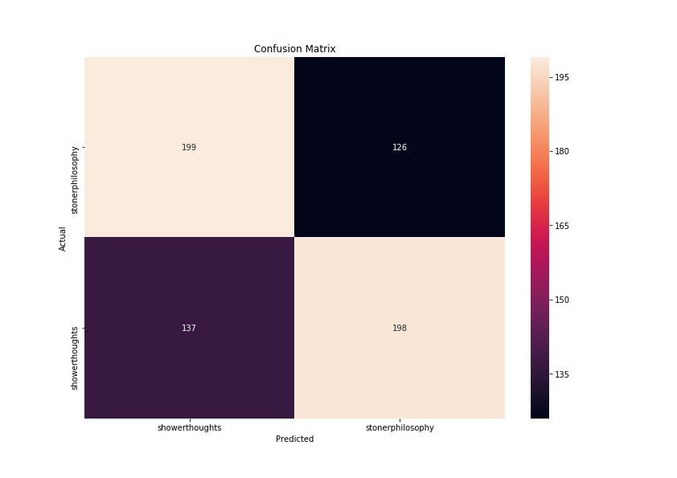
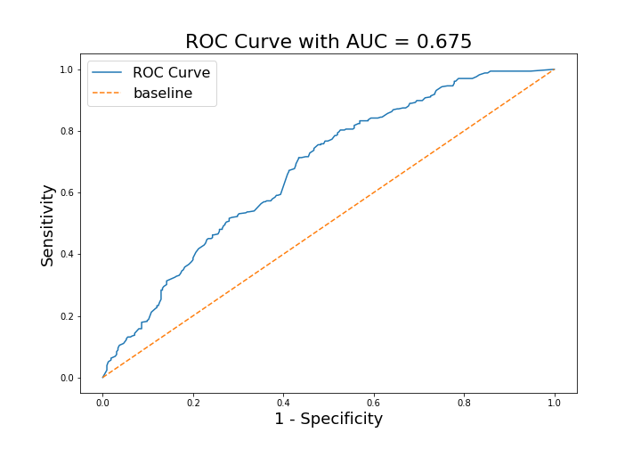
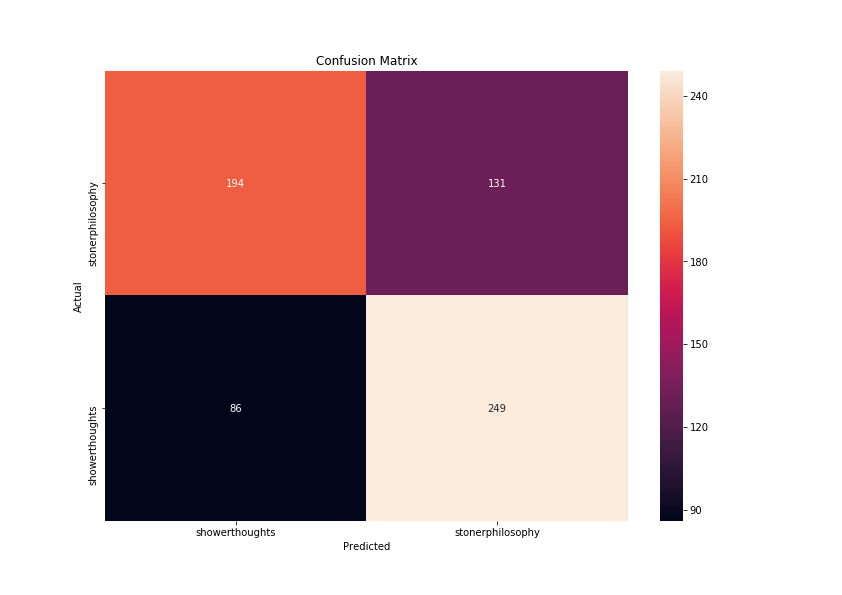

# Project 3: Subreddit Differentiation README

### Table of Contents:
- [The Data](#The-Data)
- [Exploratory Data Analysis](#Exploratory-Data-Analysis)
- [Sentiment Analysis](#Sentiment-Analysis)
- [Modeling](#Modeling)
- [Model Evaluation](#Model-Evaluation)
- [Conclusions](#Conclusions)

## 1.0 Directory Structure

```
.
├── project_3
    ├── Code
        ├── Getting_the_Data.ipynb
        ├── Models.ipynb
        ├── Project_3_Report.ipynb
        ├── Tokenizing&Lemmatizing.ipynb
    ├── Data
        ├── final.csv
        ├── shower_final.csv
        ├── stoner_final.csv
        ├── temp.csv
        ├── temp2.csv
    ├── Plots
        ├── confusion_matrix_lr.png
        ├── confusion_matrix_mnb.png
        ├── roc_auc_lr.png
        ├── roc_auc_mnb.png
    ├── README.md
    └── Project_3_Subreddit.pdf
```

## Problem Statement: 

### **The purpose of this project is to create a model that can classify between two different subreddits accurately. I have pulled data from two subreddits, 'showerthoughts' and 'stonerphilosophy'. We eventually settle on two different kinds of models, a multinomial naive bayes and a logisitic regression. In the Code directory of this repo, you can see other models that I considered. I settled on the multinomial naive bayes and logisitic regression models because I wanted my results to be interpretable. Both models do have slightly lower accuracy scores, but only by a few percentages.**

---
## 3.0 Description of Data

### 3.1 Size

* 2,000 rows, half from showerthoughts subreddit and half from stonerphilosophy
* 6 original columns, 2 more added during exploratory analysis (wordcount and sentiment)

### 3.2 Source

* showerthoughts : https://www.reddit.com/r/Showerthoughts/
* stonerphilosophy : https://www.reddit.com/r/StonerPhilosophy/

### 3.3 Data Dictionary

|Feature|Type|Description|
|---|---|---|---|
|created_utc|int64|The time the post was submitted| 
|title|object|The post's title. What we will use for modeling| 
|selftext|object|The comments of the post|
|subreddit|object|Either from 'showerthoughts' or 'stonerphilosophy'|
|permalink|object|link to exact post|
|author|object|author of the post|
|word_count|int64|The number of words in the post|
|sentiment|float64|calculated sentiment between 'lofty' and 'not lofty'|

---
## 4.0 Data Visualization



<center> This is the confusion matrix for our multinomial naive bayes model. There were 198 type 1 errors and 199 type 2 errors. We have a 0.38769230769230767 sensitivity rate and a 0.408955223880597 specificity rate. This tells us that our mnb model is better at predicting showerthoughts than stonerphilosophy.



<center> The area under the curve(AUC) of the Receiver operator curve for our mnb model, with a value of 0.675, is only slightly better than a completely random classifier.



<center> This is the confusion matrix for our logistic regression model. There were 249 type 1 errors and 194 type 2 errors. We have a 0.40307692307692305 sensitivity rate and a 0.25671641791044775 specificity rate. Interestingly enough, our logistic regression model is better at predicting stonerphilosophy posts than showerthoughts. 
    


<center> The area under the curve(AUC) of the Receiver operator curve for our mnb model, with a value of 0.708, is still only a little better than a completely random classifier. Although, it does perform better than our mnb model.
    
<center> 
    
---
## 5.0 Conclusion

Throughout this project we have gathered data using pushshift API's from two different subreddits. Our exploratory analysis involved making features that counted how many words there were in the title of the post and also tried to calculate the 'lofty' sentiment of the title. 

If we circle back to our problem statement, we wanted to try to find a model that would best classify between two subreddits. After some exploratory analysis, and various modeling (in the code directory of this repository) we chose to use a multinomial naive bayes and logistic regression model. Surprisingly, the logistic model performs the best with an AUC score of 0.708. We looked at some specific examples where both models predicted correctly, one was wrong, and both were wrong. 

### 5.1 Next Steps

In the future, we will want to try to include the engineered features into our model. 

---
## 6.0 Outside Sources

- https://stackoverflow.com/questions/47423854/sklearn-adding-lemmatizer-to-countvectorizer